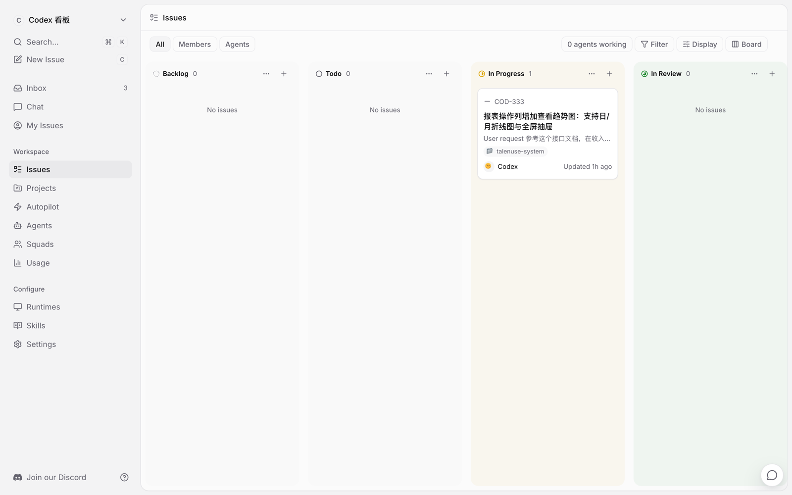
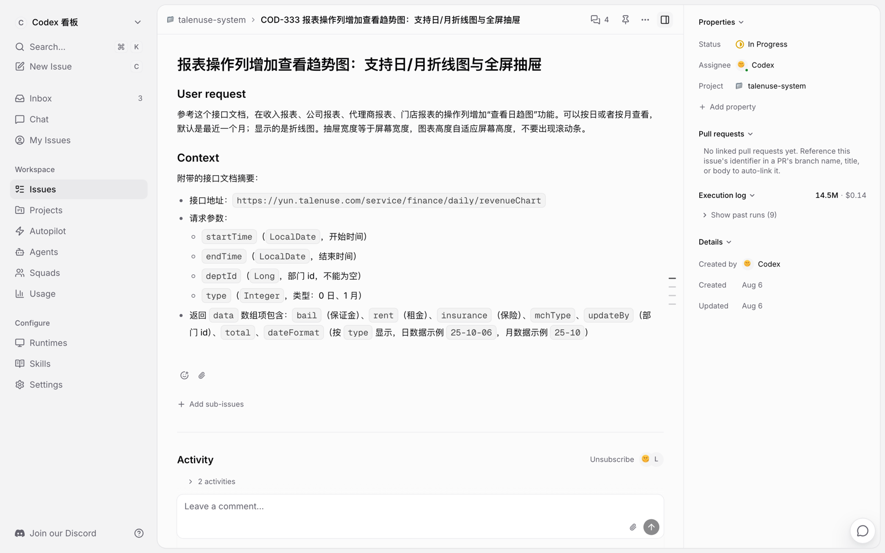
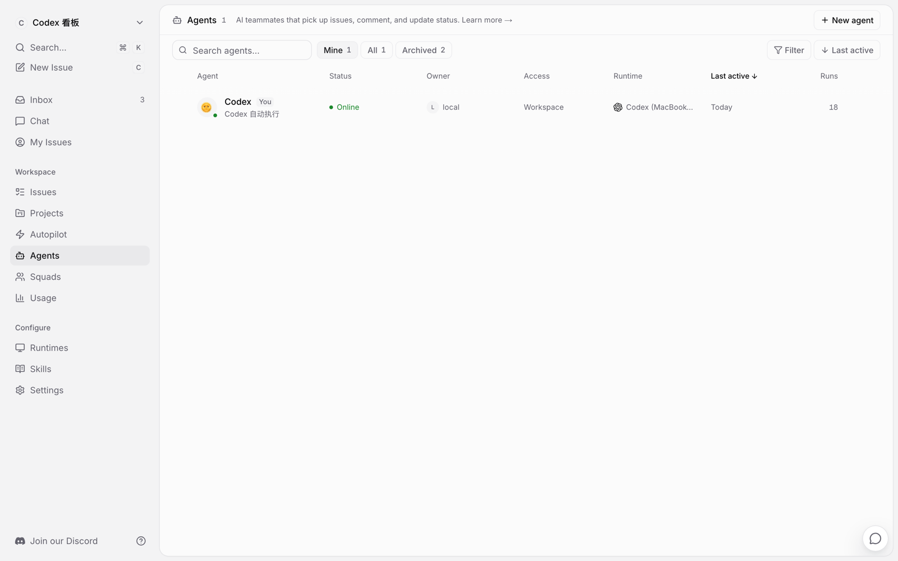
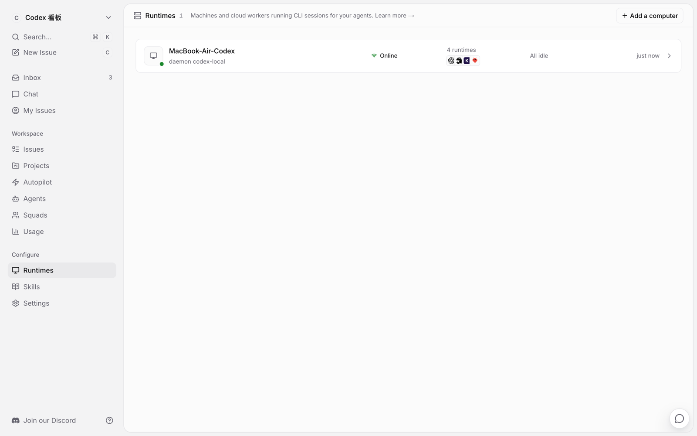

# Multica Board

> 本地任务看板，直接嵌进 Codex 侧边栏 · A local task board embedded directly into the Codex sidebar

Multica Board 是基于 Multica 开源代码做的一套**本地发行版**，它不是官方 Multica 的产品介绍，而是围绕“在你的 Mac 上跑一套完整任务看板、并让 Codex 智能体真正替你干活”这件事做的定制版本。任务数据存在你本机，服务只监听本机回环地址，安装器和侧边栏补丁都做了备份与回滚。

Multica Board is a **local distribution** built from the open-source Multica codebase. This README describes this distribution and the changes made for it, not the upstream Multica product. It runs the whole board on your Mac, keeps data on your machine, and lets Codex agents execute tasks locally.

---

## 截图 / Screenshots

以下截图来自本机真实运行的 Multica Board（截图中的任务内容都是本地数据）。

The screenshots below come from a real local Multica Board instance; all task content shown is local data.

### 看板视图 / Board View



任务按 Backlog、Todo、In Progress、In Review 分列展示。左侧是 Codex 侧边栏入口，右侧是任务看板；顶部可以看到当前工作区、Inbox、任务筛选，以及“正在工作的智能体”状态。

Tasks are grouped into Backlog, Todo, In Progress, and In Review columns. The Codex sidebar stays on the left, and the board shows filters, the current workspace, unread inbox items, and the number of agents working.

### 任务详情与工作记录 / Issue Detail & Work History



任务详情页包含标题、描述、状态、负责人、项目、属性、执行日志和 Activity 时间线。智能体完成的工作会以评论和工作记录的形式留在这里。

The issue detail page shows the description, status, assignee, project, properties, execution log, and the Activity timeline. Agent work is recorded here as comments and activity entries.

### 智能体 / Agents



智能体页面显示 Codex 是否在线、运行环境、访问权限、最近活跃时间和累计运行次数，也可以从这里创建新的智能体。

The Agents page shows whether Codex is online, its runtime, access level, last active time, and total runs, and lets you create new agents.

### 运行环境 / Runtimes



运行环境页面显示本机 daemon 的状态、在线状态和空闲情况，是智能体真正执行任务的地方。

The Runtimes page shows the local daemon, online status, and whether the machine is idle. This is where agents actually execute tasks.

---

## 这个项目做了什么 / What This Project Adds

Multica Board 在官方 Multica 的基础上做了这些本地化改造：

These are the changes this distribution adds on top of upstream Multica:

| 能力 / Feature | 说明 / Description |
| --- | --- |
| Codex 侧边栏任务看板 | 给 Codex 增加“任务看板”入口，点开就是看板页面；补丁前会备份，`patch --undo` 可回滚。 |
| 本地 PostgreSQL 数据 | 看板数据存在本机 PostgreSQL 17 + pgvector，不写入 Codex 自己的数据库。 |
| 共享/隔离 CODEX_HOME | 默认不共享桌面侧会话目录，保留隔离模式开关；共享模式也支持任务并行。 |
| 模型与推理强度选择 | 每个任务创建时可以选择当前 Codex 可用的模型和推理强度。 |
| CC Switch 兼容 | 使用 CC Switch 时，模型列表只显示 CC Switch 当前配置的模型。 |
| 多任务并行 | 支持一个智能体并行执行多个任务，默认最大并行数可配置。 |
| 斜杠唤起模式/技能 | 快速创建任务时，可以像 Codex 一样用 `/` 调用模式和技能。 |
| 中文输出 | 智能体的工作记录、评论、进度更新和聊天回复默认使用简体中文。 |
| 便携安装包 | 一条命令安装到 `/Applications/Multica Board.app`，自动下载便携 Node.js 和 PostgreSQL，不需要预装 Docker。 |
| 本地自动登录 | 安装时自动创建本地管理员、工作区和 daemon token，打开网页直接进入看板。 |

---

## 安装 / Install

前提：macOS，并且已经安装 Codex（`ChatGPT.app` 或 `Codex.app`），或者已经配置好 CC Switch。

Prerequisite: macOS with Codex installed (`ChatGPT.app` or `Codex.app`), or CC Switch configured.

```bash
curl -fsSL https://github.com/a1271981054/multica-board/releases/latest/download/install.sh | sudo bash
```

安装器会：

The installer will:

- 安装到 `/Applications/Multica Board.app`
- 首次运行下载便携 Node.js 和 PostgreSQL 17.10 + pgvector，并按 `checksums.txt` 校验
- 支持 Apple Silicon（`arm64`）和 Intel（`x86_64`）
- 数据放到 `~/Library/Application Support/Multica Board`，日志放到 `~/Library/Logs/Multica Board`
- 自动创建本地管理员、工作区和 daemon token
- 用 LaunchAgent 启动 backend / web / daemon
- 自动给 Codex 侧边栏打补丁，保留原始备份

安装完成后打开：

After install, open:

```
http://127.0.0.1:13000
```

## 常用命令 / Commands

| 命令 / Command | 作用 / Purpose |
| --- | --- |
| `multica-board status` | 查看 backend / web / daemon 状态 |
| `multica-board start` | 启动服务 |
| `multica-board stop` | 停止服务 |
| `multica-board patch` | 重新给 Codex 侧边栏打补丁 |
| `multica-board patch --undo` | 回滚 Codex 侧边栏补丁 |
| `multica-board update` | 检查 GitHub 上的新版本 |
| `multica-board uninstall` | 停止服务并卸载 |

## 本地数据与安全 / Local Data & Privacy

- 数据库：本机 PostgreSQL 17.10 + pgvector，端口默认 `15432`
- 后端：默认 `18080`
- Web：默认 `13000`
- 所有服务默认只监听 `127.0.0.1`，不开放公网
- 配置、密钥、数据库和数据都放在用户目录，不写进安装目录

## Release 资产 / Release Assets

每次发布都会上传：

- `multica-board-macos-arm64.tar.gz`
- `multica-board-macos-x86_64.tar.gz`
- `postgresql-17.10-macos-arm64.tar.gz`
- `postgresql-17.10-macos-x86_64.tar.gz`
- `checksums.txt`
- `install.sh`

## 版本记录 / Changelog

- **v0.1.5**：修复“在 Codex 中打开”被 webview 拦截的问题；新增宿主 preload + IPC 桥，改为由 Codex 主进程通过系统深链打开对应会话。
- **v0.1.4**：修复打包 daemon 的 CLI 版本，`multica` 现在上报 `0.4.19`，满足快速创建任务要求的 `≥ 0.2.21`。
- **v0.1.3**：等待目录状态改为明确提示“同一项目目录同时只允许一个任务”；快速创建弹窗显式关闭内置斜杠菜单，避免和自定义模式/技能菜单冲突。
- **v0.1.2**：共享会话在 Codex 中标记为普通用户会话，任务执行记录提供“在 Codex 中打开”深链；快速创建任务时选择模式/技能会渲染成 tag。
- **v0.1.1**：智能体的工作记录、评论、进度更新和聊天回复默认改为简体中文；保留用户使用其他语言时跟随用户语言的行为。
- **v0.1.0**：发布 macOS 本地安装包和便携 PostgreSQL 17.10 + pgvector；支持 arm64 / x86_64；安装器、LaunchAgent、Codex 侧边栏补丁与回滚、本地自动登录、自动校验 `checksums.txt`。
- 早期本地版本：Codex 侧边栏任务看板、PostgreSQL 数据存储、共享/隔离 CODEX_HOME 开关、任务创建时选择模型与推理强度、CC Switch 模型列表兼容、智能体并行执行、斜杠唤起模式/技能、快速创建任务弹窗。

## 注意事项 / Notes

- 目前没有 Apple 签名和公证，首次打开 macOS 可能要求允许运行。
- Codex 侧边栏补丁对 Codex 版本敏感，版本不匹配时安装会中止，并可用 `multica-board patch --undo` 恢复。
- Multica Board 保留了 Multica 的许可证和出处，详见 `LICENSE` 与 `NOTICE`。
